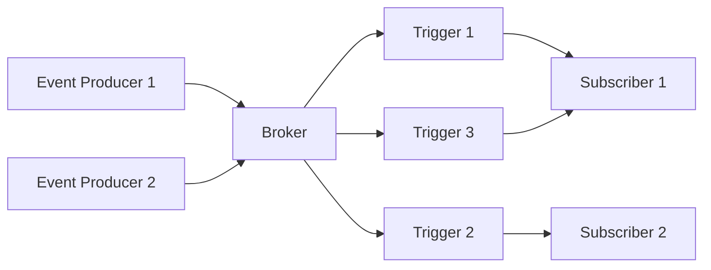
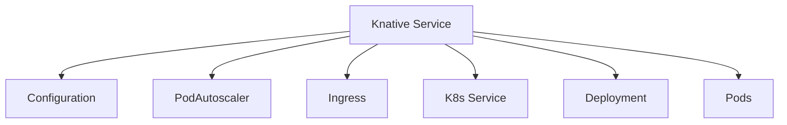
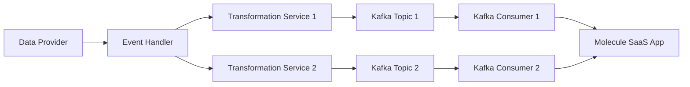

## Building Microservices Using Knative

### Overview

In this article, we will explore the development, implementation, and deployment of microservices using Knative, a powerful Kubernetes-based platform. The focus will be on leveraging various technologies to build, deploy, and manage microservices efficiently. We will cover Knative, Hashicorp Vault, and Confluent Cloud, highlighting their core capabilities and how they contribute to an overall micro-services ecosystem.  All code references in this article are available at [GitHub](https://github.com/pksurferdad/knative-microservices).  This article assumes a basic working knowledge of kubernetes to be able to provision the required infrastructure components and to deploy the example microservices in this article.

### Introduction

The following is a brief introduction into each of the components we will be discussing in this article.

#### What are Microservices?

By now, microservice architectures are clearly defined and understood, but here is a brief definition to get us started.  Microservices are a design approach where a single application is composed of many loosely coupled and independently deployable services. Each service typically represents a specific business function and can be developed, deployed, and scaled independently. The benefits of using a microservices architecture include improved fault isolation, more straightforward deployment, and the ability to use different technologies for different services and purposes.

#### Knative

Knative is an open-source platform that extends Kubernetes to provide a set of middleware components necessary for building modern, container and service based applications. It focuses on simplifying the deployment of serverless and event-driven applications. The core components of Knative are Serving, for managing the services and Eventing, for providing cloud event and messaging support. These components help developers create scalable and manageable applications by handling auto-scaling, revision management, and event-driven workflows without having to worry about the underlying infrastructure.

#### Hashicorp Vault

Hashicorp Vault is a tool for securely accessing secrets, such as API keys, passwords, and certificates. Vault manages and protects sensitive data using a combination of encryption, access control policies, and auditing. Vault ensures that your microservices can securely store and retrieve sensitive information.  This article will demonstrate how to integrate Vault with Knative services to securely fetch secrets required for your microservices.

#### Confluent Cloud

Confluent Cloud is a fully managed event streaming platform based on Apache Kafka. It enables the real-time streaming of data and integrates seamlessly with other cloud services. Core components of Confluent Cloud include Kafka clusters, connectors for data integration, and stream processing capabilities. Confluent Cloud supports building event-driven microservices by providing a reliable and scalable event streaming backbone.  This article will demonstrate how to use Confluent Cloud as the event streaming backbone for event driven Knative services.

In this article, we will delve into each of these technologies, demonstrating how to integrate them into a microservices based ecosystem using Knative. We will start by understanding the basics of Knative and proceed to set up our environment, build and deploy a microservice, handle events, explore advanced features, and finally, look at a real-world case study. Let’s get started!

### Section 1: Understanding the Basics
1. **What is Knative?**

As described above, [Knative](https://knative.dev/) provides a rich ecosystem for managing and executing microservices that can be developed in a variety of programming languages.  Any language that can be crafted into a web service and packaged as a kubernetes container is a viable execution candidate for a Knative service.  Since 2018, Knative has evolved as a viable microservices platform and in 2022 was accepted by the [CNCF](https://www.cncf.io/projects/knative/) at the `incubating` maturity level.

Knative provides the following infrastructure components that form the basis of its microservices platform:

1. [Knative Serving](https://knative.dev/docs/serving/) `required`
2. [Knative Eventing](https://knative.dev/docs/eventing/) `optional, but where it gets interesting!`

Knative Serving provides the execution platform for serverless workloads and provides the necessary components to manage the lifecycle of a microservice. Knative Services provides the following capabilities:

1. Automated Scaling
2. Revision Management
3. Traffic Splitting
4. Routing and Networking
5. Configuration and Autoscaling

Knative Eventing provides the plumbing to support event-driven and message-based architectures.  Knative Eventing provides the following capabilities:

1. Event Sources
2. Event Brokers
3. Triggers
4. Channels
5. Subscriptions

### Section 2: Setting Up Your Environment

Let's start with setting up the required infrastructure components to deploy, execute, and manage a Knative service.  The manifests referenced below are also available at [GitHub](https://github.com/pksurferdad/knative-microservices/blob/main/manifests/).

1. **Prerequisites**
   
   We will utilize [AWS EKS](https://aws.amazon.com/eks/) to host our infrastructure components on Kubernetes (K8s).  The simplest method to create a k8s cluster on AWS is to utilize [eksctl](https://eksctl.io/) following this [guidance](https://docs.aws.amazon.com/eks/latest/userguide/getting-started-eksctl.html) from AWS.  
   
   Below is a sample `eksctl` manifest to create and EKS cluster with an associated managed node group for running our workloads.

```

apiVersion: eksctl.io/v1alpha5
kind: ClusterConfig

metadata:
  name: my-knative-cluster
  region: us-east-1

availabilityZones: ['us-east-1d', 'us-east-1f']

iam:
  withOIDC: true
  serviceAccounts:
  - metadata:
      name: cluster-autoscaler
      namespace: kube-system
      labels: {aws-usage: "cluster-ops"}
    wellKnownPolicies:
      autoScaler: true
    roleName: eksctl-knative-cluster-autoscaler-role
    roleOnly: true

managedNodeGroups:
  - name: knative-private-ng
    instanceType: m5.large
    privateNetworking: true
    iam:
      withAddonPolicies:
        autoScaler: true
        certManager: true
        ebs: true
        efs: false
        cloudWatch: true
        albIngress: true
        externalDNS: true
    minSize: 2
    maxSize: 5
    desiredCapacity: 3
    volumeSize: 150
    ssh:
      allow: false
    labels: {
      role: worker,
      subnetType: private
      }
    tags:
      nodegroup-role: worker
      subnetType: private
      environment: dev

vpc:  
  clusterEndpoints:
    publicAccess: true
    privateAccess: true
   
```

Save the manifest as `eksctl-kantive.yaml` and run the command below to create the cluster:

```
eksctl create cluster -f eksctl-knative.yaml
```

Under the hood, ekctsl is using AWS CloudFormation to create the required AWS resources.  The creation process should take around 20 minutes.  

To delete the cluster and associated node group, run the command below.

```
eksctl delete cluster -f eksctl-knative.yaml
```

2. **Installing Knative**

Next, let's install Knative Serving and Eventing following this [guidance](https://knative.dev/docs/install/yaml-install/).  I typically prefer the YAML-based installation.

#### Knative Serving

Follow this [guidance](https://knative.dev/docs/install/yaml-install/serving/install-serving-with-yaml/) from Knative to install the Serving components.  

* Use `Contour` as the networking layer. I prefer `Contour` as the networking layer given some of its enhanced networking and routing capabilities.
* Configure `Real DNS` to allow your Knative Services to be accessed outside of the k8s cluster.  We'll use `knative.example.com` as the sample domain name, similar to the Knative docs.
* Install `cert-manager` to provide certificate management utilizing `lets-encrypt` as the certificate issuer.  See this [guidance](https://knative.dev/docs/serving/encryption/external-domain-tls/) from Knative that provides additional insights into the settings below.
  * Install `cert-manager` following this [guidance](https://cert-manager.io/docs/installation/kubectl/)
  * Configure the cert-manager integration to use wild card certs at namespace level to simplify the use of secured certificates.  You can use the following `patch` command to set which namespaces should use the certificate.

```
kubectl patch --namespace knative-serving configmap config-network -p '{"data": {"namespace-wildcard-cert-selector": "{\"matchExpressions\": [{\"key\":\"networking.knative.dev/disableWildcardCert\", \"operator\": \"In\", \"values\":[\"false\"]}]}"}}'
```

  * Next, add a label to the namespace where you'll be running your Knative services from to instruct Knative to generate an namespaced certificate used by all services in the namespace.

```
# create the namespace
kucectl create ns my-knative-services

# add the label
kubectl label ns my-knative-services networking.knative.dev/disableWildcardCert=false
```

  * Then, create a cluster-wide `cluster issuer` utilizing lets-encrypt as the certificate provider.  Below is a sample cluster issuer utilizing AWS Route53.

```
apiVersion: cert-manager.io/v1
kind: ClusterIssuer
metadata:
  name: letsencrypt-dns
  namespace: cert-manager
spec:
  acme:
    # The ACME server URL
    server: https://acme-v02.api.letsencrypt.org/directory
    # Email address used for ACME registration
    email: email@example.com
    # Name of a secret used to store the ACME account private key from step 3
    privateKeySecretRef:
      name: letsencrypt-private-key-dns
    solvers:
    - selector:
        dnsZones:
         - "example.com"
      dns01:
        route53:
          region: "us-east-1"
          hostedZoneID: AWSRoute53HostedZoneID
```

  * Finally, set `external-domain-tls` to `Enabled` in the `config-network` config map in the `knative-serving` namespace.

  With these settings in place, Knative can now create a secured HTTPS end-point to securely execute your Knative services.  More details to follow as we create and deploy our sample Knative services.

#### Knative Eventing

Now, let's install Knative Eventing following this [general guidance](https://knative.dev/docs/install/yaml-install/eventing/install-eventing-with-yaml/).  We'll add additional components as needed as we build out the examples that utilize Eventing capabilities.

  * [Install](https://knative.dev/docs/install/yaml-install/eventing/install-eventing-with-yaml/#install-knative-eventing) the Knative CRD's and associated manifests to install the core Eventing components.
  * [Install](https://knative.dev/docs/install/yaml-install/eventing/install-eventing-with-yaml/#optional-install-a-broker-layer) the kafka broker to install the necessary components to integrate with a Kafka cluster.

The diagram below provides an overview of the Eventing workflow that will be further illustrated with samples later in this article.



3. **Installing / Configuring Confluent Cloud**

Kafka is a powerful, but also complicated, data streaming and eventing platform. The easiest way to run a kafka cluster is to utilize Confluent's [cloud offering](https://www.confluent.io/confluent-cloud/) to provide messaging and eventing services to Knative.  Follow the [guidance](https://www.confluent.io/confluent-cloud/tryfree/) provided by Confluent to spin up a Kafka cluster.

Execute the following to connect your Knative cluster to the Confluent Cloud Kafka cluster and to create a default kafka topic that will be used by the sample event-based Knative services.

1. Create the Confluent Kafka secret to provide secure communications between your Knative services and Confluent Cloud.
   * Confluent Cloud utilizes TLS certificates from [Let's Encrypt](https://letsencrypt.org/).  You can download the referenced `.pem` file from the Let's Encrypt [Chain of Trust](https://letsencrypt.org/certificates/)
   * Create a Confluent Cloud API key and secret to use as the `user` and `password`.

```
kubectl create secret --namespace knative-eventing generic ccloud \
  --from-literal=protocol=SASL_SSL \
  --from-literal=sasl.mechanism=PLAIN \
  --from-file=ca.crt=isrgrootx1.pem
  --from-literal=user=<API KEY>
  --from-literal=password=<API SECRET>
```

2. Create a [Kafka broker](https://knative.dev/docs/install/yaml-install/eventing/install-eventing-with-yaml/#optional-install-a-broker-layer) which will auto-create a topic in Confluent.

   * Note the reference below to a `kafka-knative-dlq`, this is a Knative service that can be implemented to handle messages and events that fail to be delivered to their target destination.

```
apiVersion: eventing.knative.dev/v1
kind: Broker
metadata:
  annotations:
    # case-sensitive
    eventing.knative.dev/broker.class: Kafka
  name: knative-kafka-broker
  namespace: my-knative-services
spec:
  # Configuration specific to this broker.
  config:
    apiVersion: v1
    kind: ConfigMap
    name: kafka-broker-config
    namespace: knative-eventing
  delivery:
    deadLetterSink:
      ref:
        apiVersion: serving.knative.dev/v1
        kind: Service
        name: knative-kafka-dlq
        namespace: my-knative-services
```

* Create the broker config map. Note the end-point to the bootstrap server is provided by Confluent Cloud

```
apiVersion: v1
kind: ConfigMap
metadata:
  name: knative-broker-config
  namespace: knative-eventing
data:
  # Number of topic partitions
  default.topic.partitions: "10"
  # Replication factor of topic messages.
  default.topic.replication.factor: "3"
  # A comma separated list of bootstrap servers. (It can be in or out the k8s cluster)
  bootstrap.servers: "GetFromConfluentCloud"
  auth.secret.ref.name: ccloud
```

3. Configure the [default broker](https://knative.dev/docs/install/yaml-install/eventing/install-eventing-with-yaml/#optional-install-a-broker-layer) implementation by applying the manifest below.

```
apiVersion: v1
kind: ConfigMap
metadata:
  name: config-br-defaults
  namespace: knative-eventing
data:
  default-br-config: |
    clusterDefault:
      brokerClass: Kafka
      apiVersion: v1
      kind: ConfigMap
      name: kafka-broker-config
      namespace: knative-eventing
    namespaceDefaults:
      my-knative-services:
        brokerClass: Kafka
        apiVersion: v1
        kind: ConfigMap
        name: kafka-broker-config
        namespace: knative-eventing  
```

4. Install and configure the [kafka sink](https://knative.dev/docs/install/yaml-install/eventing/install-eventing-with-yaml/#optional-install-a-broker-layer) implementation which we'll describe in more detail later in this article, but in short, this Knative Eventing add-on will allow us to write cloud events to a Kafka topic hosted in our Confluent Cloud cluster.  The Kafka Controller has already been installed and only the [KafkaSink Data Plane](https://knative.dev/docs/eventing/sinks/kafka-sink/#installation) is required at this point.


5. **Installing / Configuring Hashicorp Vault**
   
It is beyond the scope of this article to cover all the capabilities of Hashicorp Vault; however, this article will demonstrate how to utilize Vault to provide secrets and configuration settings to Knative services.  Vault can be installed as a self-managed service in your own [K8s cluster](https://developer.hashicorp.com/vault/docs/platform/k8s/helm) or you can utilize Hashicorp's [hosted solution](https://portal.cloud.hashicorp.com/).

### Section 3: Building and Deploying a Microservice

Now that we have installed and configured Knative Serving and Eventing, backed by a kafka cluster hosted on Confluent Cloud, let's create a simple Knative service and deploy the service to the Knative cluster. In this article, we'll build our services using Python utilizing [Flask](https://flask.palletsprojects.com/), [Gunicorn[(https://gunicorn.org/)], and [Werkzeug](https://werkzeug.palletsprojects.com/) to implement the service end-point.  

1. **Creating, Deploying, and Executing a Simple Microservice**

To ensure we set up everything correctly and to understand the basics of a Knative service, let's create a simple Python service implemented using Flask.  We will continue to build upon this basic service demonstrating more advanced Knative capabilities.

In this section of the article, we will...

  1. build a simple python service
  2. create the YAML configuration to deploy the service
  3. demonstrate how to call the deployed service
  4. run the service on a schedule using a cronjob like resource from Knative called PingSource

**Simple Python Service**

Below is a simple python web service we can start with. Also available at [GitHub](https://github.com/pksurferdad/knative-microservices/tree/main/samples/simple-service).  The service simply returns a 200 OK response and also implements logging and some basic exception handling.

```
import json
import os
import flask
from flask import Flask, request, jsonify
from flask.logging import create_logger
from werkzeug.exceptions import HTTPException

# flask app configuration
app = Flask(__name__)
log = create_logger(app)
log.setLevel(os.environ.get('LOG_LEVEL', 'DEBUG'))

# Implement the main route of our application
@app.route('/', methods=['GET','POST'])
def main():

  # stuff your service does
  
  return 'Your knative service completed successfully!', 200

@app.errorhandler(HTTPException)
def handle_http_exception(e):
    log.error('HTTP Exception: %s', (e))
    response = {
        'success': False,
        'error': {
            'type': e.name,
            'message': e.description,
        }
    }    # replace the body with JSON
    return jsonify(response), e.code

@app.errorhandler(RuntimeError)
def handle_runtime_error(error):
    message = [str(x) for x in error.args]
    log.error(message)
    response = {
        'success': False,
        'error': {
            'type': error.__class__.__name__,
            'message': message
        }
    }

    return jsonify(response), 422

@app.errorhandler(Exception)
def unhandled_exception(error):
    log.error('Unhandled Exception: %s', (error))
    response = {
        'success': False,
        'error': {
            'type': error.__class__.__name__,
            'message': 'An unexpected error has occurred.',
        }
    }

    return jsonify(response), 500

if __name__ == "__main__":
    app.run(host='0.0.0.0',port=int(os.environ.get('PORT', 8080)))
```

**YAML Configuration to Deploy the Service**

To deploy the service, apply the YAML file below.  Note that the `kind` is a service; however, the manifest represents a Knative Custom Resource Definition (ksvc) that implements all the necessary kubernetes resources, listed below, to manage the full lifecycle and execution of a Knative microservice



Note the annotation `autoscaling.knative.dev/minScale: "0"` which allows a knative service to scale to 0, meaning the service will be terminated after a period of time, but will activate when a request is made against the service.  A nice way to save on Kubernetes resources.  `minScale` is one of many annotations that Knative provides to manage scaling of Knative services.  Others can be found in the Knative docs under [autoscaling](https://knative.dev/docs/serving/autoscaling/).

Save the manifest as `service.yaml` and run the command `kubectl apply -f service.yaml` to deploy the service.

```
apiVersion: serving.knative.dev/v1
kind: Service
metadata:
  name: simple-service
  namespace: my-knative-services
spec:
  template:
    metadata:
      annotations:
        autoscaling.knative.dev/minScale: "0"
    spec:
      containers:
        - image: ghcr.io/pksurferdad/knative-microservices/simple-service:latest
          name: simple-service
          command: ["/bin/bash", "-ec"]
          args: ["exec gunicorn --bind :$PORT --workers 1 --threads 8 service:app"]
```

Ensure the `simple-service` starts successfully in the `my-knative-services` namespace and if all goes well, we should now be able to call the service using the `curl` command below.

  * `my-knative-services` is the namespace where the service is running
  * `knative.example.com` is the host name we set up when we first installed and configured the Knative Serving component.

```
curl --location 'https://simple-service.my-knative-services.knative.example.com'
```

**Run The Service On A Schedule**

Now that the service is running, we can utilize another Custom Resource Definition provided by Knative Serving, `PingSource` to run our services on a schedule.  Essentially, a PingSource is an event source that produces events with a fixed payload on a specified cron schedule.  You can use `PingSource` to simply run your services on a schedule or can also pass a payload to your service to execute a specific action.  Note the `timezone` attribute in the spec that controls which time zone the schedule should executed in.  See the [PingSource](https://knative.dev/docs/eventing/sources/ping-source/reference/#pingsource) reference for additional configurations the `PingSource` CRD supports.

```
apiVersion: sources.knative.dev/v1
kind: PingSource
metadata:
  name: simple-service-pingsource
  namespace: my-knative-services
spec:
  timezone: America/New_York
  schedule: "0 10 * * *"
  sink:
    ref:
      apiVersion: serving.knative.dev/v1
      kind: Service
      name: simple-service
```

2. **Adding in Vault**

Now that we have a basic service deployed running on a schedule, let's add in Hashicorp Vault to make secrets available to our service.  The YAML below incorporates annotations for Vault which includes incorporating Vault's integration of Go [Consul Templates](https://developer.hashicorp.com/vault/docs/agent-and-proxy/agent/template).

Some things to note about the service deployment incorporating Vault secrets.

  * The role `app-user` is authorized to read and list secrets from Vault
  * The serviceAccountName `vault-auth` is authorized by Kubernetes to call the Vault secrets injection API
  * The Vault injection template loops through each secret defined in `my-secrets` creating a key-value template that is utilized by the `args` directive to mount the environment variables in the kubernetes container which makes the variables available to the service
  * The deployment also illustrates using standard Kubernetes environment variables allowing both methods, secrets from vault, and variables from the deployment manifest to make secrets and non-secured variables available to a Knative service

```
apiVersion: serving.knative.dev/v1
kind: Service
metadata:
  name: simple-service-with-vault
  namespace: my-knative-services
spec:
  template:
    metadata:
      annotations:
        autoscaling.knative.dev/minScale: "0"
        vault.hashicorp.com/agent-inject: "true"
        vault.hashicorp.com/role: "app-user"
        vault.hashicorp.com/tls-skip-verify: "true"
        vault.hashicorp.com/agent-inject-secret-my-secret.env: "secrets/my-secrets"
        vault.hashicorp.com/agent-inject-template-my-secrets.env: |
          {{- with secret "secrets/my-secrets" -}}
          {{ range $key, $value := .Data -}}
          export {{ $key }}="{{ $value }}"
          {{ end }}
          {{- end -}}
    spec:      
      imagePullSecrets:
        - name: docker-json
      serviceAccountName: vault-auth
      containers:
        - image: ghcr.io/pksurferdad/knative-microservices/simple-service:latest
          name: simple-service-with-vault
          command: ["/bin/bash", "-ec"]
          args: ["source /vault/secrets/my-secret.env &&
                  exec gunicorn --bind :$PORT --workers 1 --threads 8 service:app"]
          env:
          - name: VARIABLE_NAME
            value: VARIABLE_VALUE
```

### Section 4: Handling Events with Knative Eventing
1. **Introduction to Knative Eventing**

In this section of the article, we will focus on on how to implement Knative services that support the [cloudevents](https://cloudevents.io/) specification.  As mentioned previously, the diagram below illustrates the workflow of cloud events in Knative:


We'll demonstrate the capabilities of Knative Eventing by implementing an event handler that publishes events which are picked up by an event subscriber.  All the resources mentioned in this section are available at [GitHub](https://github.com/pksurferdad/knative-microservices/tree/main/samples).  The pattern of event producer and event subscriber provides the foundation for implementing a variety of event based applications and services. Later in the article, we'll elaborate on a real-world use-case using this pattern.

2. **Event Handler**

**Build the Event Handler**

 Let's start with the `event handler` that can handle incoming event requests and publish the requests to the Knative Eventing Broker which we created earlier in this article. 

 Below is a simple `event handler` that validates if the required cloud event headers are included with the request and if they are included, publishes the event to the Knative Eventing Broker.  As mentioned previously, the Knative Eventing Broker is backed by a Kafka cluster hosted on Confluent Cloud that provides the necessary fault tolerant and guaranteed message delivery capabilities a mission critical eventing system would need.

 Some things to note about the `event handler` service:

   * The service needs an environment variable named `broker_url` which is the url to the Knative Broker we created earlier.  To get the url of the broker, run the following kubectl command

   ```
   kubectl get broker -n my-knative-services
   ```

   * The service checks to ensure two cloud event headers, `ce_type` and `ce_source` are included in the request. These two cloud event attributes are an important component to how the events gets brokered or routed to the desired target to handle the payload of the event
   * The service utilizes the `cloudevents` python library to build and structure the event to be published

 ```
import json
import os
import requests
import flask
from flask import Flask, request, jsonify
from flask.logging import create_logger
from werkzeug.datastructures import Headers
from werkzeug.exceptions import HTTPException
from cloudevents.http import CloudEvent, to_structured

# flask app configuration
app = Flask(__name__)
log = create_logger(app)
log.setLevel(os.environ.get('LOG_LEVEL', 'DEBUG'))


# environment variables
broker_url = os.environ.get('BROKER_URL', None)

@app.route('/', methods=['POST'])
def main():
    # process the request message and send it to the knative broker
    event_headers = request.headers
    event_message = request.get_json(force=True)

    required_headers = ['ce_type', 'ce_source']
    missing_headers = [header for header in required_headers if header not in event_headers]

    if missing_headers:
        log.debug(f'event message: {event_message}')
        raise RuntimeError(f'Message cannot be processed. Missing required event headers: {", ".join(missing_headers)}')

    # build the event and http request
    attributes = {
        'type' : event_headers['ce_type'],
        'source' : event_headers['ce_source']
    }

    event = CloudEvent(attributes,event_message)
    headers, body = to_structured(event)

    resp = requests.post(broker_url,
                         headers=headers,
                         data=body)
    
    if resp.status_code != 202:
        raise RuntimeError(f"Unexpected status code {resp.status_code}: {resp.text}")
    
    log.info("sent message for event: {}. broker response: response code {} response text {}".format(event_headers['ce_type'],resp.status_code, resp.text))
    
    response = {
    'success' : True,
    'message' : 'Message successfully processed!'
    }

    return jsonify(response), 200
    

@app.errorhandler(HTTPException)
def handle_http_exception(e):
    log.error('HTTP Exception: {}'.format(e))
    response = {
        'success': False,
        'error': {
            'type': e.name,
            'message': e.description,
        }
    }    # replace the body with JSON
    return jsonify(response), e.code


@app.errorhandler(RuntimeError)
def handle_runtime_error(error):
    message = [str(x) for x in error.args]
    log.error(message)
    response = {
        'success': False,
        'error': {
            'type': error.__class__.__name__,
            'message': message
        }
    }

    return jsonify(response), 422


@app.errorhandler(Exception)
def unhandled_exception(error):
    log.error('Unhandled Exception: {}'.format(error))
    response = {
        'success': False,
        'error': {
            'type': error.__class__.__name__,
            'message': 'An unexpected error has occurred.',
        }
    }

    return jsonify(response), 500


if __name__ == "__main__":
    app.run(host='0.0.0.0', port=int(os.environ.get('PORT', 8080)))

 ```

**Deploy the Event Handler**

Now, let's deploy the event handler to our Knative cluster.  Apply the manifest below to deploy the service.

Some things to note about the Knative service deployment:

* The deployment is using Hashicorp Vault to maintain secrets and we can include the `broker_url` variable in vault
* The `minScale` annotation is set to `3` which indicates we want 3 load balanced services to run continuously.  This is desirable to handle concurrent requests hitting the Knative service.  Knative Serving also has the ability to scale up services based on Knative Serving's built in [autoscaling](https://knative.dev/docs/serving/autoscaling/) capabilities.

```
apiVersion: serving.knative.dev/v1
kind: Service
metadata:
  name: event-handler
  namespace: my-knative-services
spec:
  template:
    metadata:
      annotations:
        autoscaling.knative.dev/minScale: "3"
        vault.hashicorp.com/agent-inject: "true"
        vault.hashicorp.com/role: "app-user"
        vault.hashicorp.com/tls-skip-verify: "true"
        vault.hashicorp.com/agent-inject-secret-my-secrets.env: "secrets/my-secrets"
        vault.hashicorp.com/agent-inject-template-my-secrets.env: |
          {{- with secret "secrets/my-secrets" -}}
          {{ range $key, $value := .Data -}}
          export {{ $key }}="{{ $value }}"
          {{ end }}
          {{- end -}}
    spec:      
      imagePullSecrets:
        - name: docker-json
      serviceAccountName: vault-auth
      containers:
        - image: ghcr.io/pksurferdad/knative-microservices/event-handler:latest
          name: event-handler
          command: ["/bin/bash", "-ec"]
          args: ["source /vault/secrets/my-secrets.env &&
                  exec gunicorn --bind :$PORT --workers 1 --threads 8 service:app"]
```

2. **Event Subscriber**

**Build the Event Subscriber**

Now that we have an event handler running, let's build the other side the eventing implementation and create the event subscriber.  The event subscriber will handle events and the associated payloads that are pushed to the subscriber. 

Below is a simple event subscriber that will process the published event.

```
import json
import os
import requests
import flask
from flask import Flask, request, jsonify
from flask.logging import create_logger
from werkzeug.datastructures import Headers
from werkzeug.exceptions import HTTPException

# flask app configuration
app = Flask(__name__)
log = create_logger(app)
log.setLevel(os.environ.get('LOG_LEVEL', 'DEBUG'))

@app.route('/', methods=['POST'])
def main():
    # process the event message delivered by the event broker
    event_message = request.get_json(force=True)

    # do something with the event message
    log.info('Received event message: {}'.format(json.dumps(event_message)))

    response = {
    'success' : True,
    'message' : 'Message successfully processed!'
    }

    return jsonify(response), 200
    

@app.errorhandler(HTTPException)
def handle_http_exception(e):
    log.error('HTTP Exception: {}'.format(e))
    response = {
        'success': False,
        'error': {
            'type': e.name,
            'message': e.description,
        }
    }    # replace the body with JSON
    return jsonify(response), e.code


@app.errorhandler(RuntimeError)
def handle_runtime_error(error):
    message = [str(x) for x in error.args]
    log.error(message)
    response = {
        'success': False,
        'error': {
            'type': error.__class__.__name__,
            'message': message
        }
    }

    return jsonify(response), 422


@app.errorhandler(Exception)
def unhandled_exception(error):
    log.error('Unhandled Exception: {}'.format(error))
    response = {
        'success': False,
        'error': {
            'type': error.__class__.__name__,
            'message': 'An unexpected error has occurred.',
        }
    }

    return jsonify(response), 500


if __name__ == "__main__":
    app.run(host='0.0.0.0', port=int(os.environ.get('PORT', 8080)))
```

**Deploy the Event Subscriber**

Apply the manifest below to deploy the `event subscriber`

```
apiVersion: serving.knative.dev/v1
kind: Service
metadata:
  name: event-subscriber
  namespace: my-knative-services
spec:
  template:
    metadata:
      annotations:
        autoscaling.knative.dev/minScale: "1"
        vault.hashicorp.com/agent-inject: "true"
        vault.hashicorp.com/role: "app-user"
        vault.hashicorp.com/tls-skip-verify: "true"
        vault.hashicorp.com/agent-inject-secret-my-secrets.env: "secrets/my-secrets"
        vault.hashicorp.com/agent-inject-template-my-secrets.env: |
          {{- with secret "secrets/my-secrets" -}}
          {{ range $key, $value := .Data -}}
          export {{ $key }}="{{ $value }}"
          {{ end }}
          {{- end -}}
    spec:      
      imagePullSecrets:
        - name: docker-json
      serviceAccountName: vault-auth
      containers:
        - image: ghcr.io/pksurferdad/knative-microservices/event-subscriber:latest
          name: event-handler
          command: ["/bin/bash", "-ec"]
          args: ["source /vault/secrets/my-secrets.env &&
                  exec gunicorn --bind :$PORT --workers 1 --threads 8 service:app"]
```

3. **Event Trigger**

We now have the `event handler` and the `event subscriber`, but how do we now connect the two together?  Introducing the Knative Eventing [trigger](https://knative.dev/docs/eventing/triggers/#example-triggers).  Using the Knative Broker we created earlier, the Knative trigger will instruct the Knative Broker to publish events to the `event-subscriber` service for events that have a `type` of `event-subscriber-type` and a `source` of `event-subscriber-source`.

Apply the manifest below to deploy the trigger.

```
apiVersion: eventing.knative.dev/v1
kind: Trigger
metadata:
  name: event-subscriber-trigger
  namespace: my-knative-services
spec:
  broker: knative-kafka-broker
  filter:
    attributes:
      type: event-subscriber-type
      source: event-subscriber-source
  subscriber:
    ref:
      apiVersion: serving.knative.dev/v1
      kind: Service
      name: event-subscriber
```

Run the kubectl command below to ensure the trigger is in a ready state.

```
kubectl get trigger event-subscriber-trigger -n my-knative-services
```

4. **Test the Event Workflow**

To test the overall eventing workflow, you can run the curl command below which will call the `event handler` and pass in the `cloud event` headers and the payload to be routed to the `event subscriber`.

```
curl --location 'https://event-handler.my-knative-services.knative.example.com' \
--header 'Content-Type: application/json' \
--header 'ce_source: event-subscriber-source' \
--header 'ce_type: event-subscriber-type' \
--data '{
    "event_data_1": "data value 1",
    "event_data_2": "data value 2",
    "event_data_3": "data value 2"
}'
```

To ensure everything worked as expected, you can use the kubectl command below to tail the logs of both the `event handler` and the `event subscriber`.

```
kubectl logs -f <event handler pod> -c event-handler -n my-knative-services
kubectl logs -f <event subscriber pod> -c event-subscriber -n my-knative-services
```

5. **Incorporate the KafkaSink Add-on**

Earlier in this article, we installed the KafkaSink add-on. This add-on gives us the ability to reliably publish cloud events to a Kafka topic hosted on our Confluent Cloud kafka cluster.  In this section of the article, we'll set up an instance of the KafkaSink add-on and incorporate the add-on in a Knative Service that publishes a cloud event to a Kafka topic.

**Configure the KafkaSink Add-on**

Let's first configure and create a KafkaSink resource using the manifest below.  Before applying the manifest, you can manually create the topic `mytopic` in the Confluent Cloud cluster.

```
apiVersion: eventing.knative.dev/v1alpha1
kind: KafkaSink
metadata:
   name: my-kafka-sink
   namespace: my-knative-services
spec:
   topic: mytopic
   bootstrapServers:
      - "GetFromConfluentCloud"
   auth.secret.ref.name: ccloud
```

To get the URL to the `KafkaSink` resource, run the kubectl command below.  

```
kubectl get kafkasink -n knative-eventing
```

The `KafkaSink` URL should look something like `http://kafka-sink-ingress.knative-eventing.svc.cluster.local/my-knative-services/my-kafka-sink`.

**Sample Service Using the KafkaSink Add-on**

The Knative Service below is a variant of the `event subscriber` service with the addition of publishing an event to a Kafka topic using the `KafkaSink` resource we created above.  Note that the service takes an environment variable `KAFKA_SINK_URL` which is the URL we got from the above kubectl command.  

```

import json
import requests
import os
from flask import Flask, request, jsonify
from flask.logging import create_logger
from werkzeug.datastructures import Headers
from werkzeug.exceptions import HTTPException
from cloudevents.http import CloudEvent, to_structured 

# flask app configuration
app = Flask(__name__)
log = create_logger(app)
log.setLevel(os.environ.get('LOG_LEVEL', 'DEBUG'))

# environment variables
KAFKA_SINK_URL = os.environ.get('KAFKA_SINK_URL', None)
headers = {'content-type': 'application/json'}

@app.route('/', methods=['POST'])
def main():
    # process the request message and send it to the knative kafka sink resource
    event_headers = request.headers
    event_message = request.get_json(force=True)

    # do something with the event message
    log.info('event message: {}'.format(event_message))
    
    # build the event and http request
    attributes = {
        'type' : 'dev.kafka.type',
        'source' : 'dev.kafka.source'
    }

    event = CloudEvent(attributes,event_message)
    headers, body = to_structured(event)

    # send the event to the kafka-sink-url
    resp = requests.post(KAFKA_SINK_URL, headers=headers, data=body)
    log.info('response code: {}'.format(resp.status_code))

    if resp.status_code != 202:
        raise RuntimeError(str(resp.status_code) + ' ' + resp.text)

    return '', 200
    

@app.errorhandler(HTTPException)
def handle_http_exception(e):
    log.error('HTTP Exception: {}'.format(e))
    response = {
        'success': False,
        'error': {
            'type': e.name,
            'message': e.description,
        }
    }    # replace the body with JSON
    return jsonify(response), e.code


@app.errorhandler(RuntimeError)
def handle_runtime_error(error):
    message = [str(x) for x in error.args]
    log.error(message)
    response = {
        'success': False,
        'error': {
            'type': error.__class__.__name__,
            'message': message
        }
    }

    return jsonify(response), 422


@app.errorhandler(Exception)
def unhandled_exception(error):
    log.error('Unhandled Exception: {}'.format(error))
    response = {
        'success': False,
        'error': {
            'type': error.__class__.__name__,
            'message': 'An unexpected error has occurred.',
        }
    }

    return jsonify(response), 500


if __name__ == "__main__":
    app.run(host='0.0.0.0', port=int(os.environ.get('PORT', 8080)))
```

**Deploy the Event Subscriber with Sink Service**

You can use the manifest below to deploy the event subscriber with the added KafkaSink support.  Note that if you are using Hashicorp Vault integration, the `KAFKA_SINK_URL` is in the `my-secrets` secret.

```
apiVersion: serving.knative.dev/v1
kind: Service
metadata:
  name: event-subscriber-with-sink
  namespace: my-knative-services
spec:
  template:
    metadata:
      annotations:
        autoscaling.knative.dev/minScale: "1"
        vault.hashicorp.com/agent-inject: "true"
        vault.hashicorp.com/role: "app-user"
        vault.hashicorp.com/tls-skip-verify: "true"
        vault.hashicorp.com/agent-inject-secret-my-secrets.env: "secrets/my-secrets"
        vault.hashicorp.com/agent-inject-template-my-secrets.env: |
          {{- with secret "secrets/my-secrets" -}}
          {{ range $key, $value := .Data -}}
          export {{ $key }}="{{ $value }}"
          {{ end }}
          {{- end -}}
    spec:      
      imagePullSecrets:
        - name: docker-json
      serviceAccountName: vault-auth
      containers:
        - image: ghcr.io/pksurferdad/knative-microservices/event-subscriber-with-sink:latest
          name: event-handler
          command: ["/bin/bash", "-ec"]
          args: ["source /vault/secrets/my-secrets.env &&
                  exec gunicorn --bind :$PORT --workers 1 --threads 8 service:app"]
```

**Event Trigger with Sink**

Use the trigger below to connect the `event handler` to the `event subscriber with sink` service.

```
apiVersion: eventing.knative.dev/v1
kind: Trigger
metadata:
  name: event-subscriber-with-sink-trigger
  namespace: my-knative-services
spec:
  broker: knative-kafka-broker
  filter:
    attributes:
      type: event-subscriber-type
      source: event-subscriber-source
  subscriber:
    ref:
      apiVersion: serving.knative.dev/v1
      kind: Service
      name: event-subscriber-with-sink

```

### Section 6: Case Study

Now that we have all the building blocks for building out event-based microservices, let's bring this all together with a real-world case study. At [Molecule](https://www.molecule.io), where I'm responsible for software and platform engineering, we utilize the eventing pattern described in this article to support integrations we do with 3rd party data providers that implements the workflow depicted below. 



**Data Provider** 

The `data provider` is the component that connects to the data source, in Molecule's case, typically a commodity trade or commodity pricing data provider, utilizing the data provider's API.  The data provider component fetches the data from the provider and calls the `event handler` including the `ce-source` (e.g. my-exchange) and `ce-type` (e.g. my-trade) in the request header and the payload of the data in the request body.

**Event Handler**

As described in this article, the `event handler` will package up the cloud event and post the event to the Knative event broker which will route the event to the `event subscriber` based on the configuration in the Knative trigger. 

```
apiVersion: eventing.knative.dev/v1
kind: Trigger
metadata:
  name: transformation-service-1-trigger
  namespace: my-knative-services
spec:
  broker: knative-kafka-broker
  filter:
    attributes:
      type: my-trade
      source: my-exchange
  subscriber:
    ref:
      apiVersion: serving.knative.dev/v1
      kind: Service
      name: transformation-service-1
```

**Transformation Service**

In this use case, the `transformation service` is the event subscriber which will receive the event with the payload from the `data provider` component.  Utilizing mapping configurations, the transformation service will transform attributes of the source payload to data attribute formats and structures required by the Molecule SaaS application.  Utilizing the KafkaSink resource, the transformation services publishes the event to the sink end-point which persists the event to the configured Kafka topic hosted on our Confluent Cloud cluster.

```
apiVersion: eventing.knative.dev/v1alpha1
kind: KafkaSink
metadata:
   name: my-trade-sink
   namespace: my-knative-services
spec:
   topic: my-trades
   bootstrapServers:
      - "GetFromConfluentCloud"
   auth.secret.ref.name: ccloud
```

**Kafka Consumer**

Within the Molecule application boundary, Molecule implements multiple Kafka consumers that subscribe to the Kafka topics to pull and post the trade and market data to the Molecule SaaS application.

**Molecule SaaS App**

The Molecule SaaS application then does its part with the data providing Commodity Trading and Risk Management services to our customers.   

### Conclusion

Hopefully this article has provided the reader with some guidance and direction on how to implement, deploy, and manage Knative Services to support business critical event-based applications.  The patterns outlined in this article can be used for a variety of use cases and business problems.  If you have any questions or run into any issues with the samples that are published in this article, feel free to reach out to me at paul@molecule.io or post an issue to the [GitHub project](https://github.com/pksurferdad/knative-microservices/issues).